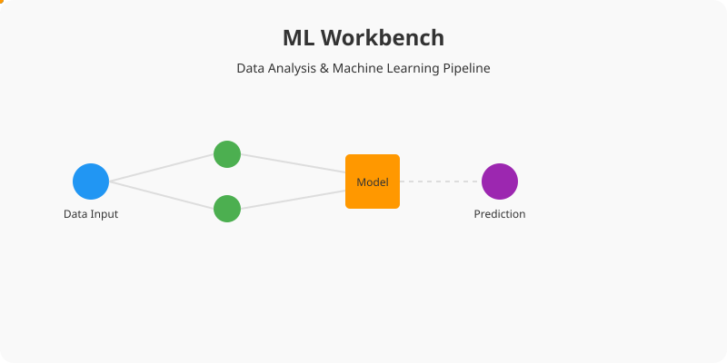

# ML Workbench



**ML Workbench** is a powerful and intuitive Streamlit application designed to streamline your machine learning workflow. From data upload to model deployment, ML Workbench provides a unified interface for all your data analysis needs.

## Features

- **Easy Data Upload**: Support for CSV file uploads.
- **Comprehensive Preprocessing**:
    - Handle missing values.
    - Normalize numeric columns.
    - Automatic identification of numeric and categorical columns.
- **Model Training**:
    - Support for multiple algorithms including:
        - Linear Regression
        - Random Forest (Regressor & Classifier)
        - K-Nearest Neighbors (Regressor & Classifier)
        - Support Vector Machines (SVR & SVC)
        - Logistic Regression
        - Decision Tree
        - Naive Bayes
- **Performance Evaluation**:
    - Accuracy score and classification report for classifiers.
    - Mean Squared Error (MSE) for regressors.
- **Interactive Prediction**: Test your trained model with custom inputs directly in the app.
- **Model Export**: Save your trained model and metadata as a ZIP file for deployment.

## Installation

1. Clone the repository:
   ```bash
   git clone https://github.com/sowmiyan-s/ML-WorkBench.git
   ```
2. Navigate to the project directory:
   ```bash
   cd ML-WorkBench
   ```
3. Install the required dependencies:
   ```bash
   pip install -r requirements.txt
   ```

## Usage

Run the Streamlit app:
```bash
streamlit run Main.py
```

## Credits

Created by [Sowmiyan S](https://github.com/sowmiyan-s).

License: MIT